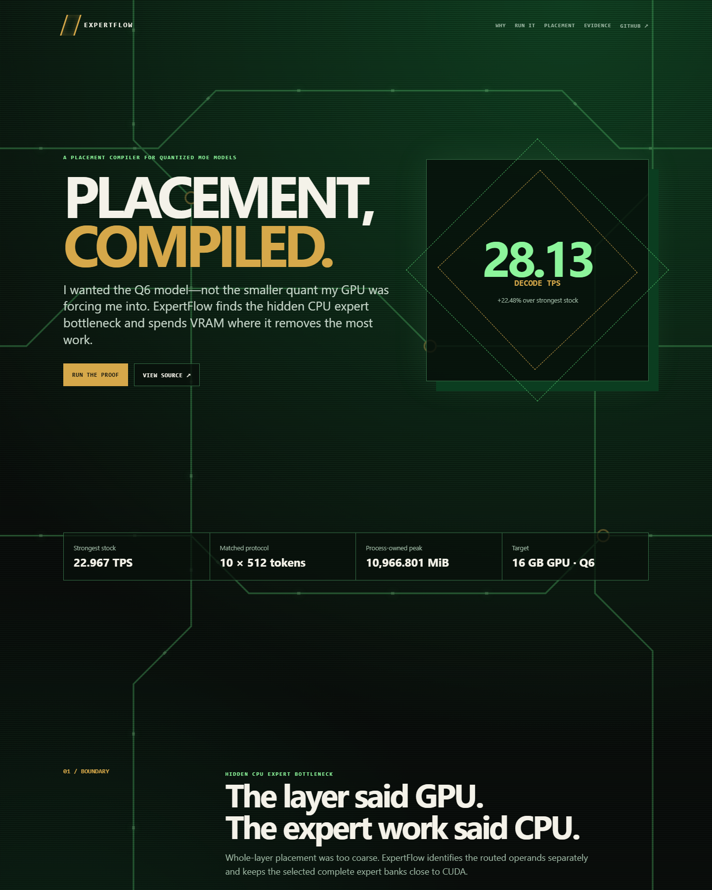

<p align="center">
  
</p>

# ExpertFlow

### A placement compiler for quantized MoE models.

Run the high-quality model you want, not the smaller quant your GPU forces you into.

## 28.13 TPS · 22.48% faster than stock · 16 GB GPU · Q6

```console
uv sync --frozen
uv run expertflow demo --replay
```

The replay needs no GGUF, CUDA installation, or NVIDIA GPU. It verifies the committed evidence and reconstructs the measured result in about a minute.


## Why does this exist?

Gemma 4 26B A4B is sparse, but its expert banks still have to live somewhere. Stock llama.cpp can keep that routed-expert work on CPU, which fits but creates a bottleneck. Whole-layer CUDA offload is too coarse for this memory budget.

The usual layer count also hides the interesting part: a layer can appear GPU-offloaded while its expert matmuls still execute on CPU. ExpertFlow profiles those operations separately and places the complete expert banks that remove the most CPU work per byte of VRAM.

## What measurable difference does it make?

On Gemma 4 26B A4B IT Q6_K, ExpertFlow measured **28.13 decode TPS**. The strongest fair stock Q6 configuration reached **22.967 TPS**. That is a **22.48% improvement** on the same 16 GB RTX 5060 Ti.

The matched protocol used ten 512-token runs. Peak process-owned VRAM was **10,966.801 MiB**.

The winning placement keeps complete 128-expert Q6 banks for layers `[0, 1, 2, 3, 4, 5, 6, 7, 8, 9, 15, 20]` on CUDA.

## Can I see it immediately?

Yes. Run the two commands at the top of this page. The replay checks the evidence hash, then prints the stock result, ExpertFlow result, placement, VRAM, quality status, and cache decision.

For a visual replay, open `release/expertflow-build-week/dashboard.html`. Judges can choose a quick replay, compatible live run, or full source reproduction in [JUDGES.md](JUDGES.md).

The redesigned narrative dashboard is also available at `docs/evidence/product-release/dashboard.html`. See [DEPLOYMENT.md](DEPLOYMENT.md) for Vercel deployment, local dashboard hosting, evidence replay, compatible NVIDIA setup, and pinned-runtime instructions.

For the complete product model, component boundaries, runtime data flow, and evidence-backed architecture, read the [Product and Architecture Guide](docs/PRODUCT.md).

### Links for judges

- [Repository](https://github.com/crankysmh47/Expertflow)
- [Product architecture](docs/PRODUCT.md)
- [Live dashboard source](docs/evidence/product-release/dashboard.html)
- [Deployment guide](DEPLOYMENT.md)

## How does it work?

ExpertFlow reads measured routing and backend-placement evidence, ranks complete expert banks by CPU relief per byte of VRAM, and emits a deployment manifest. The Q6 runtime establishes placement before graph construction. Selected packed operands remain on CUDA with identity logical-to-physical mapping.

There is no eviction, reactive loading, repacking, prediction, or per-token transfer in the shipped configuration.



That last sentence matters because the project did not begin with static placement.

We tested observer paths, reactive caches, temporal prediction, and asynchronous sidecar transfers. Some experiments preserved exact outputs but ran slower. Others reached clean architectural stop conditions. A bounded cache simulation combining measured Q6 routing with measured transfer costs found `NO CACHE OPPORTUNITY` on this GPU. The evidence favored complete static residency, so that is what ExpertFlow ships.

## How Codex and GPT-5.6 built ExpertFlow

GPT-5.6 was part of the entire ideation and project progression, not a final documentation pass. It helped turn the initial predictive-cache idea into a sequence of bounded experiments, interpret failures, define stop conditions, and change the product direction when measurements contradicted the original plan.

Codex with GPT-5.6-sol managed the engineering workflow end to end. That included:

- creating and protecting isolated Git worktrees;
- investigating llama.cpp and instrumenting the real routing path;
- writing tests before each narrow runtime experiment;
- collecting traces, timings, VRAM measurements, hashes, and environment metadata;
- implementing cache, observer, predictor, Q6 placement, and product experiments;
- diagnosing failed approaches without weakening correctness gates;
- running repeated parity and performance checks;
- maintaining the append-only command and decision ledger;
- packaging the CLI, replay, dashboard, judge paths, and release archive;
- handling the small tweaks and verification work needed to keep the project shippable.

The human role stayed explicit. I chose the problem, set the scientific gates, approved or rejected scope changes, and made the final product calls. Codex handled the implementation loop and kept the evidence organized enough for those decisions to be made from measurements rather than intuition.

Primary `/feedback` Session ID: **UNRESOLVED — ADD THE REQUIRED SESSION ID BEFORE SUBMISSION.**

## Can I run it live?

The verified live path requires Windows 11 x64, an NVIDIA GPU, the ExpertFlow llama.cpp build, and a user-supplied `google_gemma-4-26B-A4B-it-Q6_K.gguf`.

```powershell
$env:EXPERTFLOW_MODEL_PATH = "C:\path\to\google_gemma-4-26B-A4B-it-Q6_K.gguf"
$env:EXPERTFLOW_LLAMA_CLI = "C:\path\to\llama-cli.exe"
$env:EXPERTFLOW_LLAMA_SERVER = "C:\path\to\llama-server.exe"

uv run expertflow doctor --model $env:EXPERTFLOW_MODEL_PATH --runtime $env:EXPERTFLOW_LLAMA_CLI --server $env:EXPERTFLOW_LLAMA_SERVER
./scripts/live-tps-demo.ps1 -Mode Demo
uv run expertflow profile $env:EXPERTFLOW_MODEL_PATH
uv run expertflow optimize $env:EXPERTFLOW_MODEL_PATH --goal max-performance --output deployment.json
uv run expertflow run deployment.json --model $env:EXPERTFLOW_MODEL_PATH
uv run expertflow compare deployment.json
```

`live-tps-demo.ps1` performs a fresh matched stock/ExpertFlow pair and saves the raw evidence. It is the fastest live judge path; the headline claim still comes from ten matched pairs.

The expected model SHA-256 is `089ecf3bbad0b18b187ff1b3de171413f8a5d8fb246bc1b776a68c95ad9a07ba`.

### OpenAI-compatible local serving

```powershell
uv run expertflow optimize $env:EXPERTFLOW_MODEL_PATH --goal agentic --output deployment.json
uv run expertflow serve deployment.json
uv run python examples/agentic_session.py
```

The measured four-slot profile completed 20/20 requests at **35.6699 aggregate generated TPS**, compared with 24.5231 stock. This is a concurrent server-throughput measurement, not the single-stream 28.13 TPS protocol.

## What are the limitations?

- The strict +1% PPL confidence gate was not met. The point estimate improved by 2.92%, but the 95% upper bound was +2.25%.
- MMLU moved from 49/100 to 50/100.
- Four-slot outputs were not fully deterministic across repetitions.
- A 262,144-token context was allocated with 675.418 MiB reserve, but the bounded run processed 417 tokens. This is not a filled-context claim.
- Predictive caching was simulated and rejected. It is not a measured cache-runtime result and is not shipped.
- Live acceleration is verified on the documented Windows/NVIDIA system. Other live platforms remain unverified or unsupported.

The machine-readable source of truth is `release/expertflow-build-week/evidence/release-scorecard.json`. Benchmark protocol and comparability rules are in [docs/BENCHMARKING.md](docs/BENCHMARKING.md).

## Supported platforms

| Platform | Evidence replay | Live ExpertFlow CUDA |
|---|---:|---:|
| Windows 11 x64 + NVIDIA RTX 5060 Ti 16 GB | Supported | Verified |
| Other Windows x64 + NVIDIA CUDA | Supported | Compatible, unverified |
| Linux x64 + NVIDIA | Supported | Experimental, unverified |
| macOS / Metal | Supported | Unsupported; replay only |
| AMD Vulkan or ROCm | Supported | Unsupported; replay only |
| CPU-only | Supported | Unsupported; replay only |

This matrix describes ExpertFlow evidence, not every backend supported by upstream llama.cpp.

## Reproduction

Use [JUDGES.md](JUDGES.md) for the replay, compatible live inference, and clean runtime build paths. The release archive includes the upstream pin, ordered patch series, compiler and CUDA versions, binary hashes, model hash, setup scripts, and SHA-256 manifest.

Applicable tests:

```powershell
uv sync --frozen
$env:PYTHONPATH = "$PWD;$PWD\src"
uv run pytest -q --ignore=tests/test_t1_temporal_source_contract.py --ignore=tests/test_t2_sidecar_source_contract.py
```

Those two source-contract modules belong to a preserved temporal-cache llama.cpp branch. The Q6 release does not ship the temporal cache.

## License

MIT. See [LICENSE](LICENSE) and [THIRD_PARTY_NOTICES.md](THIRD_PARTY_NOTICES.md).
