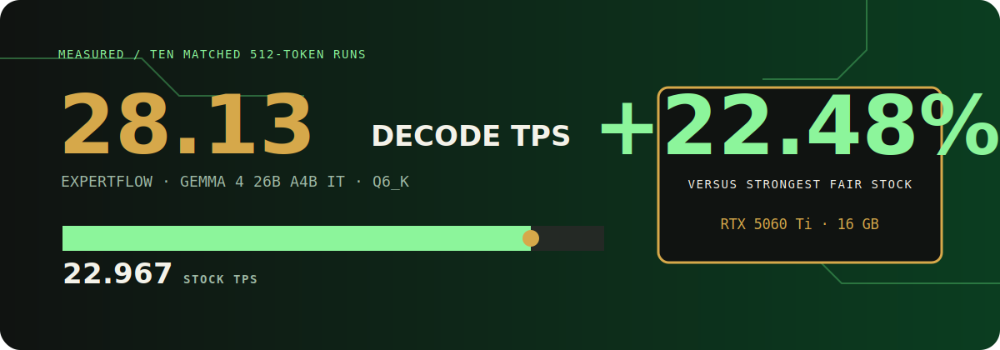

# ExpertFlow

### A placement compiler for quantized MoE models.

Run the high-quality model you want, not the smaller quant your GPU forces you into.

## 28.13 TPS · 22.48% faster than stock · 16 GB GPU · Q6

```console
uv sync --frozen
uv run expertflow demo --replay
```

The replay needs no GGUF, CUDA installation, or NVIDIA GPU. It verifies the committed evidence and reconstructs the measured result in about a minute.

## Why does this exist?

A model can report CUDA-offloaded layers while expensive routed-expert operations still execute on CPU. ExpertFlow profiles those hidden operations and moves only the highest-value expert banks to persistent CUDA storage.


```text
STOCK
Router on GPU -> expert matmuls on CPU -> copy result to GPU
                         | bottleneck

EXPERTFLOW
Router on GPU -> selected expert banks on GPU -> output stays near CUDA
```

## What measurable difference does it make?

On Gemma 4 26B A4B IT Q6_K, ExpertFlow ran at 28.13 decode TPS. The strongest fair stock Q6 configuration reached 22.967 TPS. That is a 22.48% improvement on the same 16 GB RTX 5060 Ti.



The winning placement keeps complete 128-expert banks for layers `[0, 1, 2, 3, 4, 5, 6, 7, 8, 9, 15, 20]` on CUDA. Peak process-owned VRAM was 10,966.801 MiB.


## Can I see it immediately?

Yes. The first command above installs the frozen Python environment. The second verifies the evidence hash and prints the stock result, ExpertFlow result, placement, VRAM, quality status, and cache decision. For a visual replay, open `release/expertflow-build-week/dashboard.html`.

Judges can use the three progressively deeper paths in [JUDGES.md](JUDGES.md).

## How does it work?

ExpertFlow reads measured routing and backend-placement evidence, ranks the expert banks that offer the most CPU relief per byte of VRAM, and emits a deployment manifest. The Q6 release uses full static identity shadows: every one of the 128 experts for each selected layer is copied once into packed CUDA storage. There is no eviction, per-token loading, repacking, prediction, or reactive cache in the shipped configuration.


Predictive caching was evaluated in simulation from measured routing and transfer data. On this GPU it cost more throughput than the saved memory was worth, so ExpertFlow chose full residency.

## Can I run it live?

The live path requires the verified ExpertFlow llama.cpp build and a user-supplied `google_gemma-4-26B-A4B-it-Q6_K.gguf`.

```powershell
$env:EXPERTFLOW_MODEL_PATH = "C:\path\to\google_gemma-4-26B-A4B-it-Q6_K.gguf"
$env:EXPERTFLOW_LLAMA_CLI = "C:\path\to\llama-cli.exe"
$env:EXPERTFLOW_LLAMA_SERVER = "C:\path\to\llama-server.exe"
uv run expertflow doctor --model $env:EXPERTFLOW_MODEL_PATH --runtime $env:EXPERTFLOW_LLAMA_CLI --server $env:EXPERTFLOW_LLAMA_SERVER
uv run expertflow run deployments/max-performance.json --model $env:EXPERTFLOW_MODEL_PATH
```

The expected model SHA-256 is `089ecf3bbad0b18b187ff1b3de171413f8a5d8fb246bc1b776a68c95ad9a07ba`.

## Agentic workflow

The measured four-slot profile exposes llama-server's OpenAI-compatible API at `http://127.0.0.1:8080/v1`.

```powershell
uv run expertflow optimize $env:EXPERTFLOW_MODEL_PATH --goal agentic --output deployment.json
uv run expertflow serve deployment.json
uv run python examples/agentic_session.py
```

Four slots completed 20/20 requests at 35.6699 aggregate generated TPS. That result is a server throughput measurement, not the single-stream 28.13 TPS protocol.


## Evidence and limitations

> [!IMPORTANT]
> - The strict +1% PPL confidence gate was not met. The point estimate improved by 2.92%, but the 95% upper bound was +2.25%.
> - MMLU increased from 49/100 to 50/100.
> - Four-slot outputs were not fully deterministic across repetitions.
> - A 262,144-token context was allocated with 675.418 MiB reserve; the bounded run processed 417 tokens. It was not a fully filled context test.
> - Predictive caching was simulated and rejected. It is not a measured cache runtime result and is not shipped.

The machine-readable source of truth is `release/expertflow-build-week/evidence/release-scorecard.json`. Benchmark protocol and comparability rules are in [docs/BENCHMARKING.md](docs/BENCHMARKING.md).

## How Codex and GPT-5.6 were used

Codex implemented the isolated worktrees, runtime instrumentation, tests, Q6 placement, benchmark harnesses, evidence package, CLI, and release checks. The user set the scientific gates, rejected misleading baselines, and made the product calls. GPT-5.6 helped scope bounded experiments, interpret failures, freeze decision gates, and turn the measured result into a usable workflow.

Primary `/feedback` Session ID: **UNRESOLVED — ADD THE REQUIRED SESSION ID BEFORE SUBMISSION.**

## Supported platforms

| Platform | Evidence replay | Live ExpertFlow CUDA |
|---|---|---|
| Windows 11 x64 + NVIDIA RTX 5060 Ti 16 GB | Supported | Verified |
| Other Windows x64 + NVIDIA CUDA | Supported | Compatible, unverified |
| Linux x64 + NVIDIA | Supported | Experimental, unverified |
| macOS / Metal | Supported | Unsupported; replay only |
| AMD Vulkan or ROCm | Supported | Unsupported; replay only |
| CPU-only | Supported | Unsupported; replay only |

This matrix describes ExpertFlow evidence, not every backend supported by upstream llama.cpp.

## Reproduction

Use [JUDGES.md](JUDGES.md) for replay, compatible live inference, or a clean runtime build. The release archive includes the upstream pin, ordered patch series, build versions, binary hashes, model hash, setup scripts, and SHA-256 manifest.

Applicable tests:

```powershell
uv sync --frozen
$env:PYTHONPATH = "$PWD;$PWD\src"
uv run pytest -q --ignore=tests/test_t1_temporal_source_contract.py --ignore=tests/test_t2_sidecar_source_contract.py
```

The excluded source-contract modules belong to a different preserved temporal-cache llama.cpp branch; the Q6 release contains no temporal cache.

## License

MIT. See [LICENSE](LICENSE) and [THIRD_PARTY_NOTICES.md](THIRD_PARTY_NOTICES.md).
