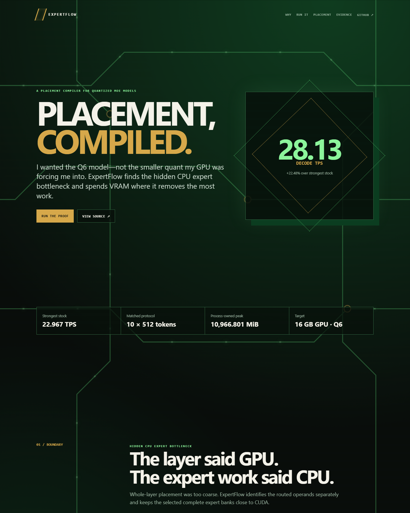

<p align="center">
  
</p>

# ExpertFlow

### A hardware-aware configuration compiler for quantized MoE inference.

ExpertFlow measures eligible runtime configurations and emits validated execution plans. Stock selection is validated on Gemma Q6, Gemma Q4 and Granite Q6 on one Windows/NVIDIA system. Placement acceleration remains a research goal: the historical faster placement failed its quality gate.

Read [current status](docs/STATUS.md), [tasks](docs/TODO.md), and the concise [placement proof and stock-tuning fallback plan](docs/superpowers/plans/2026-10-04-placement-proof-and-stock-fallback.md). The [placement feasibility audit](docs/evidence/placement-proof-20261004/feasibility.md) found no new exact mechanism under the pinned kernels.

The [original stock-tuning utility study](docs/evidence/stock-utility-20261004/report.md) confirmed **12.70%** gain over resolved thread/graph defaults and manual equivalence. Its final sealed-plan equivalence check was **inconclusive**, so that study remains closed without new acceptance or transfer.

The separate [repeatability and transfer proof](docs/evidence/stock-repeatability-20261004/report.md) **passed all 148 calls and final reconstruction**. Both independent main blocks and both fresh consumers passed. Held-out stock tuning gained **9.38%** over resolved 8-thread/graphs-on defaults, CI95 **[7.92%, 10.61%]**, and matched an independent manual grid at equal 18-evaluation budgets. This qualifies bounded stock autotuning on the pinned Q6 workloads under fixed spacing and diagnostics. The [wider Q4/Granite comparison](docs/evidence/stock-coverage-20261005/report.md) completed 344 calls; all four cases were **NO-UTILITY-GAIN** under the fixed 5% gate. Other hosts and serving performance remain unverified.

## Installation and CLI

Requires Python 3.11+ and `uv`.

```console
uv sync --frozen
uv run expertflow --help
```

The current workflow verifies model bytes and inventory, runtime, host and workload; establishes a reference and paired product acceptance; searches a bounded eligible space; and validates an execution plan and evidence receipt. Changed inputs invalidate reuse. No qualifying challenger means the validated incumbent is retained.

Use [the stock configuration method](docs/stock-configuration-method.md) for collection, audit, validation and execution commands. These need explicit input files and local native artifacts. The public CLI and benchmark scripts exist; one command that optimizes any supplied GGUF is a future product goal.

## What is validated today?

| Model | Accepted result | Evidence |
| --- | --- | --- |
| Gemma 4 26B A4B Q6_K | Stock acceptance passed; bounded search retained 12 threads/graphs on | [Q6 report](docs/evidence/stock-discovery-20261004/report.md) |
| Gemma 4 26B A4B Q4_0 | Separate reference/product/search passed; same incumbent retained | [Q4 report](docs/evidence/stock-discovery-20261004/q4-report.md) |
| Granite 3.1 1B-A400M Q6_K | Real second-family reference/product/search passed; GPU-resident incumbent retained | [Granite report](docs/evidence/compiler-granite-20261004/report.md) |
| Gemma Q6 held-out stock utility | 12 threads/graphs on; +9.38% over resolved defaults, fresh product and consumer passed | [Repeatability/transfer proof](docs/evidence/stock-repeatability-20261004/report.md) |

These results establish reproducible stock selection within declared spaces, with no newly accepted gain over tuned stock. Granite's small, fully resident model establishes compatibility; Q4 is a separate quantization. Neither proves quality-preserving Gemma Q6 acceleration or a global optimum.

Gemma profiling identified CPU expert work as a substantial decode bottleneck, but synchronized diagnostics perturb overlap. Placement research ranks complete expert banks by CPU relief per byte of VRAM. Its numerical and quality contracts must pass before a faster plan becomes an accepted result.

## Historical release replay

```console
uv run expertflow demo --replay
```

No GGUF, CUDA installation or GPU is needed. Replay verifies historical evidence integrity; a replay `pass` is not quality acceptance or a fresh live benchmark. The archived dashboards and release ZIP describe that earlier release.



On Gemma Q6, historical static placement measured **28.13 TPS**. A separate strongest historical stock reference was **22.967 TPS**, giving **22.48%** against that reference. The ten matched pairs themselves measured 22.28/28.13 TPS. Peak process-owned VRAM was 10,966.801 MiB. The terminal verdict was **QUALITY STOP**; this is not an accepted quality-preserving acceleration claim.

Complete expert banks for layers `[0, 1, 2, 3, 4, 5, 6, 7, 8, 9, 15, 20]` remained on CUDA without eviction or per-token loading. CPU-to-CUDA placement changed the numerical path, and historical response hashes differed. The strict +1% PPL confidence gate was **not met**: the favorable -2.92% point estimate had a +2.25% upper 95% bound. See the [original report](docs/evidence/q6-placement-final/report.md).

Other historical release boundaries: four-slot outputs were **not fully deterministic**; their aggregate TPS is a separate objective. A **262,144**-token context was allocated, but only **417** tokens were processed. The release scorecard reports MMLU 49/100 to 50/100; the terminal placement study stopped before MMLU. Reactive/predictive caching and mover no-go verdicts remain closed.

The historical scorecard is `release/expertflow-build-week/evidence/release-scorecard.json`. Current accepted authorities are linked from [STATUS.md](docs/STATUS.md).

## Interfaces and scope

Current compiler interfaces include `expertflow inspect`, `expertflow compile`, `expertflow validate`, `expertflow explain` and `expertflow run --plan`. The public `expertflow stock` interface now delegates reference, product and search workflows to their registered collectors and provides read-only utility/repeatability validation. See [the method guide](docs/stock-configuration-method.md) for prerequisite inputs and supported actions.

```powershell
uv run --no-sync expertflow stock --help
uv run --no-sync expertflow stock search generate --help
uv run --no-sync expertflow stock repeatability validate --output-dir C:/models/expertflow/runs/compiler-stock-repeatability-20261004
uv run --no-sync expertflow stock coverage inspect
```

These research workflows require a matching checkout; use `stock --project C:/sem4/expertflow ...` when invoking an installed wheel elsewhere. Help works without models. Native operations also require the pinned binaries, local evidence and development source-contract checks. Closed utility/repeatability studies expose validation only. JSON decisions distinguish verified negative/neutral outcomes from invalid inputs and include covered identities, comparison costs and stop reasons.

Read-only validation reuses one verified reader per database while retaining artifact/runtime/token checks and the existing model stat guard. The final adapter validated the completed study in 221 seconds versus the earlier 2,191 seconds, with five reader caches and zero new native calls; these are descriptive timings. All 41 frozen files and six historical pins remained unchanged. [Verification and source archive](docs/evidence/stock-cli-20261005/report.md).

[Wider utility coverage](docs/evidence/stock-coverage-20261005/report.md) completed four Q4/Granite prose/code cases with 86 calls each, fixed 30-second spacing and 63 frozen source/input files. Q4 gains of +1.03%/+0.78% fell below the 5% gate; Granite retained the default with −0.02%/−0.23% paired changes. No new product or consumer ran. Fresh public validation passed in 93.40 seconds with zero extra native calls, and the independent final raw audit passed. The immutable registration inspector describes protocol pins, not live execution progress.

```powershell
uv run --no-sync expertflow stock coverage run --help
uv run --no-sync expertflow stock coverage validate --help
```

The registered sequence is closed. Use `uv run --no-sync expertflow stock coverage validate` to reconstruct its four outcomes. `coverage run` refuses the occupied fixed roots and has no retry/resume operation; further experiments require a separate registration. A neutral/default-optimal case remains `NO-UTILITY-GAIN`. See the [collector plan](docs/superpowers/plans/2026-10-05-wider-stock-collector.md).

The subsequent [offload/attention/batch audit](docs/evidence/stock-control-scope-20261006/report.md) found no new useful control qualified under the current exact profile. Further native optimization needs numerical qualification and a concrete benefit mechanism, or a separate quality policy and acceptance protocol. The audit made zero native calls; the completed studies remain closed.

The [follow-through](docs/evidence/stock-followthrough-20261006/report.md) rejected explicit flash-attention enable as a new supported fused-decode mechanism: pristine stock already resolves AUTO support. This is a source-feasibility result, with no new quality or speed measurement. Work continued into the bounded stock prototype.

Inspect its archived outcomes or delegate fresh reconstruction to the existing public CLI:

```powershell
uv run --no-sync python scripts/stock_product_status.py status
uv run --no-sync python scripts/stock_product_status.py verify --output-dir C:/models/expertflow/runs/stock-product-user-check-01
```

Verification requires a fresh output directory and the original local artifacts. The helper launches zero model processes, retains failed diagnostics, and preserves each positive or negative outcome. Fresh local qualification of both studies passed in 331.65 seconds with zero additional native calls; see the [receipt](docs/evidence/stock-followthrough-20261006/verification.json). The next gate is the [five-task independent-user handoff](docs/stock-product-handoff.md), reported **not tried yet**. Independent-user usability and portability remain unmeasured.

The earlier deployment interface remains available: `expertflow doctor`, `expertflow profile`, `expertflow optimize`, positional `expertflow run`, `expertflow serve` and `expertflow compare`. Its setup is documented in the historical [judge guide](JUDGES.md) and [deployment guide](DEPLOYMENT.md). It does not promote the old placement result into current exact acceptance.

| Platform | Historical replay | Current live compiler evidence |
| --- | --- | --- |
| Pinned Windows 11 x64 / RTX 5060 Ti 16 GB system | Supported | Stock acceptance verified for the listed artifacts/workloads |
| Other Windows/NVIDIA or Linux/NVIDIA systems | Supported | Unverified; new scope and live validation required |
| macOS, AMD or CPU-only systems | Supported | Historical replay only |

The GGUFs, local measurement databases and native binaries are not bundled. Current evidence does not establish universal support or automatic speedups.

## Development checks

```powershell
uv sync --frozen --extra dev --extra quality --extra predictor
uv run --no-sync pytest -q
uv run --no-sync python -m compileall -q src/expertflow
git diff --check
```

Latest full suite: **891 passed, 7 historical source-environment skips**; six applicable pinned native source checks and seven installed-wheel checks passed separately. See [wider implementation verification](docs/evidence/stock-coverage-20261005/implementation-review.md). Run applicable source contracts against the exact external checkout they target. CPU tests and replay do not prove native speed or quality.

## Project documentation

- [Product architecture](docs/PRODUCT.md): current compiler and historical placement architecture.
- [Benchmarking](docs/BENCHMARKING.md): comparable workloads and acceptance boundaries.
- [Repository](https://github.com/crankysmh47/Expertflow).
- [Live dashboard](https://expertflow-zeta.vercel.app): historical release presentation.
- [Deployment guide](DEPLOYMENT.md): historical replay and live setup.
- [Project log](PROJECT_LOG.md): chronological evidence and decisions.

## How Codex was used

Codex with GPT-5.6-sol managed the engineering workflow: source investigation, isolated native experiments, test-first changes, measurements, parity checks, evidence review, failure diagnosis and release packaging. The human chose the problem, scientific gates and product direction. Historical failures remain part of the record.

The archived submission still has an unresolved primary `/feedback` session ID; resolve it before any submission. Current research progress is tracked separately.

## License

MIT. See [LICENSE](LICENSE) and [THIRD_PARTY_NOTICES.md](THIRD_PARTY_NOTICES.md).
