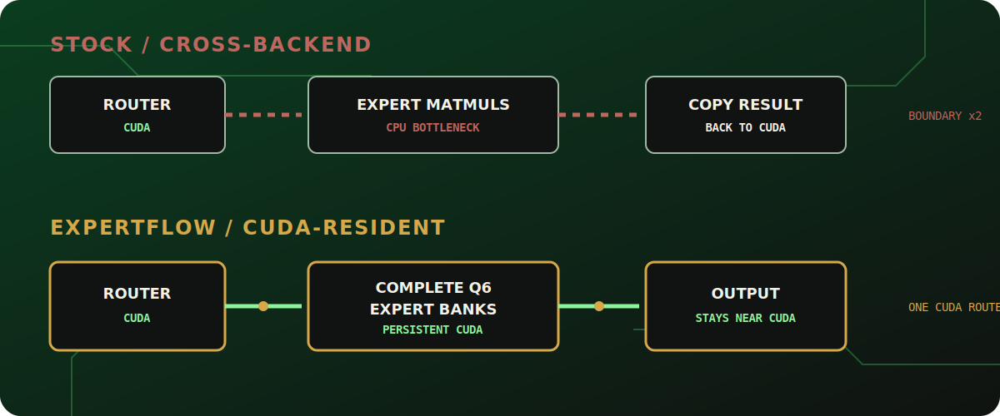
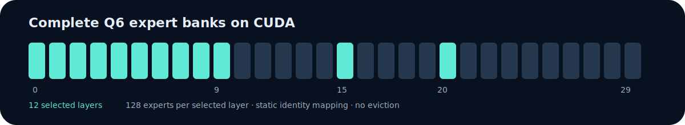
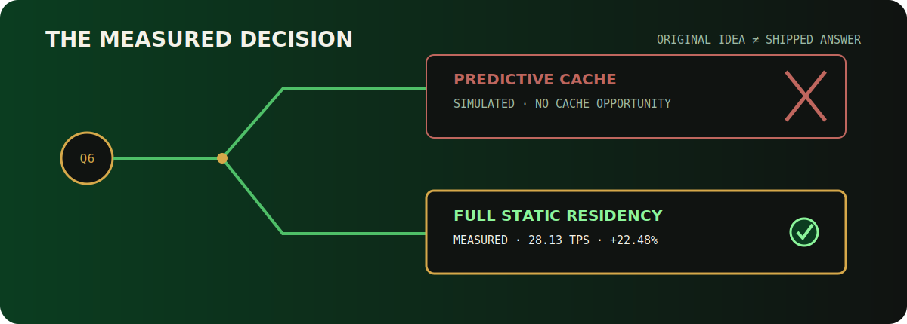
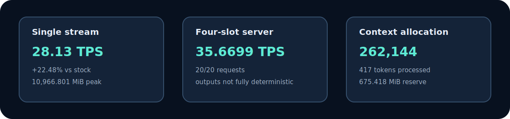

# ExpertFlow Product and Architecture Guide

ExpertFlow is a placement compiler for quantized mixture-of-experts models. It profiles where sparse-model work actually executes, decides which complete expert banks deserve scarce VRAM, and emits a reproducible deployment plan for a compatible llama.cpp runtime.

The important idea is not that one fixed set of layers is always best. The product turns measurements, model structure, and a hardware budget into a **hardware-specific emitted plan**.

## 1. The problem

Sparse models activate only a subset of their experts for each token, but all expert weights still need a home. On a memory-constrained GPU, stock deployment can place the router and surrounding layer work on CUDA while leaving routed expert matrix multiplications on CPU. That configuration fits, but every token pays for a hidden CPU bottleneck.

Whole-layer offload is too coarse: moving an entire transformer layer may exceed the VRAM budget even when moving its routed expert bank would remove considerably more CPU work per byte.



### Stock execution boundary

```text
router on GPU -> selected expert matmuls on CPU -> result copied toward GPU
```

### ExpertFlow execution boundary

```text
router on GPU -> selected CUDA-resident expert bank -> output remains near CUDA
```

ExpertFlow changes placement, not routing semantics. The model's true router remains authoritative.

## 2. Product pipeline

```text
Profile -> Compile -> Place -> Run -> Verify
```

1. **Profile** inventories the GGUF, identifies routed tensors, measures backend placement and layer cost, and records exact expert-bank bytes.
2. **Compile** ranks candidate placements by measured CPU relief, VRAM cost, compatibility, and the configured objective.
3. **Place** writes a portable deployment manifest describing model identity, selected layers, runtime parameters, and evidence provenance.
4. **Run** launches the pinned ExpertFlow llama.cpp runtime with that plan. `serve` exposes the same placement through an OpenAI-compatible endpoint.
5. **Verify** checks model and binary hashes, replays committed evidence, and compares matched stock and ExpertFlow runs.

```text
GGUF inventory + measured profile + GPU budget
                       |
                       v
              ExpertFlow optimizer
                       |
                       v
                 deployment.json
                 /             \
        llama-cli runner     llama-server
                 \             /
             compiled CUDA placement
```

The deployment manifest is the boundary between the Python product and the patched runtime. The CLI does not infer benchmark results: replay and comparison commands read classified evidence, while live commands launch fresh processes.

## 3. Runtime architecture

The shipped runtime creates full packed CUDA shadow tensors for selected MoE layers before graph construction. Original expert sources remain CPU-backed. Expert operations for a selected layer consume the CUDA shadow directly through the existing compatible operation.

### Complete expert-bank bundle

A physical placement is valid only when every expert-indexed operand moves together:

- fused gate/up expert weights;
- down expert weights;
- quantization scales and metadata represented by the packed GGUF tensors;
- shapes, strides, alignment, and expert-axis ordering.

Moving only gate/up or only down would mix logical experts and invalidate execution. ExpertFlow therefore treats the complete packed bank as one placement unit.

### Identity remapping

The released static configuration uses **Identity remapping**: logical expert `n` remains physical expert `n` within the 128-expert CUDA shadow. There is no slot lookup on the critical path and no packed representation conversion.

### What is deliberately absent

- **No eviction** or replacement.
- No reactive expert loading.
- No prediction or learned routing policy.
- No repacking on inference.
- No per-token expert transfer.
- No replacement MoE kernel.

These are architectural outcomes, not omissions hidden by the presentation. Earlier cache and predictor prototypes informed the decision, but their transfer and remapping costs did not produce the best Q6 product on this GPU.

## 4. The shipped Q6 plan

For the verified 16 GB RTX 5060 Ti system, the compiler output retained complete 128-expert Q6 banks for layers:

```text
0, 1, 2, 3, 4, 5, 6, 7, 8, 9, 15, 20
```



This is a hardware-specific emitted plan produced by the bounded measured search. It is not a claim that these layers are universally optimal for other GPUs, quantizations, models, prompts, or runtime builds.

The twelve shadows allocate 8,231,196,672 bytes. Placement is established before execution; the feature remains gated and stock behavior is restored when ExpertFlow is disabled.

## 5. Measured result

The authoritative single-stream protocol used ten matched 512-token runs with the same model, prompt, context, seed, thread count, CUDA settings, and runtime family.

| Measurement | Result | Class |
|---|---:|---|
| ExpertFlow decode | **28.13 TPS** | Measured |
| Strongest stock decode | **22.967 TPS** | Measured |
| Improvement | **22.48%** | Calculated from measured means |
| Peak process-owned VRAM | **10,966.801 MiB** | Measured |
| Selected expert-bank layers | **12 of 30** | Measured configuration |

The quality point estimates did not show a decline: MMLU moved from 49/100 to 50/100, and PPL changed by -2.92%. The predefined strict PPL confidence requirement was not met because the 95% upper bound was +2.25%. ExpertFlow reports that boundary instead of turning it into a stronger claim.

The machine-readable authority is repository path `docs/evidence/product-release/release-scorecard.json`, linked here as the [release scorecard](evidence/product-release/release-scorecard.json). The protocol and comparability rules are in [BENCHMARKING.md](BENCHMARKING.md).

## 6. Why the cache became a compiler

ExpertFlow began as a live expert-cache investigation. Observer, reactive-cache, temporal-predictor, and asynchronous sidecar milestones tested whether routed experts could move into VRAM just in time.

Several stages preserved exact behavior, but reactive transfers blocked inference and broader caching did not produce the needed end-to-end gain. The final bounded simulation combined measured Q6 routing with measured transfer and cache costs and returned `NO CACHE OPPORTUNITY` for this target.



The product pivot is the innovation: use profiling and compiler-like placement to remove the expensive boundary before inference, instead of trying to predict around it during inference.

## 7. CLI and serving surfaces

```text
expertflow doctor     verify machine, model, and runtime identity
expertflow profile    inspect model and placement evidence
expertflow optimize   compile a deployment manifest
expertflow run        launch local generation
expertflow serve      launch the OpenAI-compatible server
expertflow compare    compare classified measurements
expertflow demo       replay the signed-off evidence package
```



`doctor` fails explicitly on missing files, hash mismatches, unsupported live paths, insufficient resources, or incompatible binaries. `demo --replay` is model-free and works from committed evidence; it is not presented as a live benchmark.

## 8. Reproduction paths

There are three increasingly demanding proof paths:

1. **Replay:** `uv sync --frozen` followed by `uv run expertflow demo --replay`.
2. **Live matched check:** on compatible Windows/NVIDIA hardware, run `.\scripts\live-tps-demo.ps1 -Mode Demo` with the documented model and runtime variables.
3. **Full rebuild:** apply the packaged ordered patch series to pinned llama.cpp commit `a7312ae94f801fc9c6786dc56e38df57b964f697`, build with the recorded MSVC/CUDA configuration, and follow [product-reproduction.md](product-reproduction.md).

The GGUF is not bundled. The expected Q6 model SHA-256 is `089ecf3bbad0b18b187ff1b3de171413f8a5d8fb246bc1b776a68c95ad9a07ba`.

## 9. Supported scope

Evidence replay is portable across ordinary Python platforms. Live acceleration is verified on Windows 11 x64, NVIDIA CUDA, and the documented RTX 5060 Ti 16 GB system. Other NVIDIA configurations may be compatible but require fresh profiling and verification. Linux/NVIDIA live execution remains experimental and unverified; CPU-only, AMD, and macOS paths are replay-only in this release.

ExpertFlow currently targets the documented Gemma 4 26B A4B Q6_K tensor layout and pinned llama.cpp fork. It is a reproducible hackathon product, not yet a general-purpose replacement for llama.cpp placement across every MoE architecture.

## 10. How GPT-5.6 and Codex were used

GPT-5.6 supported the entire ideation and product progression: framing hypotheses, defining empirical gates, interpreting failures, and redirecting the project when cache results contradicted the original plan.

Codex with GPT-5.6-sol managed the engineering loop end to end: repository isolation, source investigation, test-first runtime changes, trace collection, CUDA and VRAM measurements, parity checks, failure diagnosis, evidence classification, release packaging, dashboard work, and final verification. The human retained product authority and approved every material scope change.

That workflow is reflected in the append-only [`../PROJECT_LOG.md`](../PROJECT_LOG.md) and detailed evidence tree. Failed experiments remain part of the technical record because they explain why the shipped architecture is simpler and faster than the initial design.

## 11. Where to go next

- [README](../README.md): fastest product introduction.
- [Judge guide](../JUDGES.md): quickest verification route.
- [Deployment guide](../DEPLOYMENT.md): hosted dashboard and local hardware setup.
- [Benchmarking protocol](BENCHMARKING.md): fair-comparison rules.
- [Release scorecard](evidence/product-release/release-scorecard.json): machine-readable claims.
- [Final Q6 report](evidence/q6-placement-final/report.md): measured placement study.
- [Troubleshooting](product-troubleshooting.md): operational failures and recovery.
