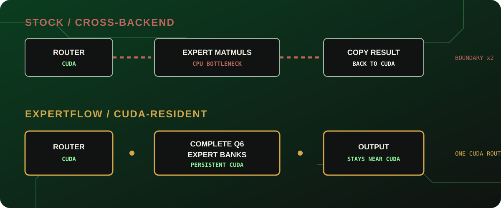
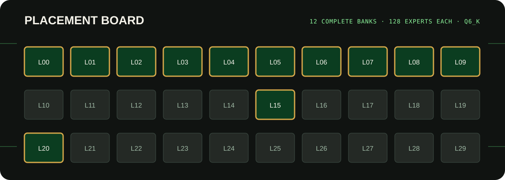
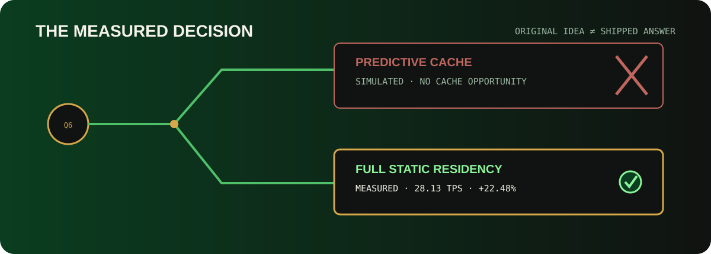
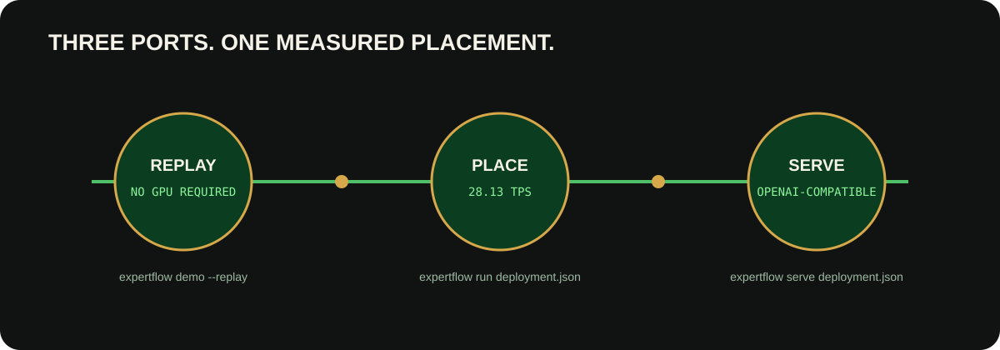

# ExpertFlow Product and Architecture Guide

## Local product implementation

The user authorized the [remaining product roadmap](TODO.md) on 2026-10-06.
The product direction is portable local GGUF setup, measured configuration,
reusable profiles and reliable run/serve workflows for local-model enthusiasts.
The initial qualification target is Windows/NVIDIA; Linux needs native evidence.
The optional TUI follows observed pilot friction. Exact tuning remains the default.
Implementation is underway; the historical results below remain scoped evidence,
and do not establish new-product usability, dense-family or serving acceptance.
The independent [pilot task sheet](../local-product-pilot.md) is prepared; no human
results have been collected. See the roadmap for release gates.

ExpertFlow compiles measured, eligible MoE runtime configurations into validated execution plans. The current accepted path is stock selection on Gemma Q6, Gemma Q4 and Granite Q6 on one pinned Windows/NVIDIA system. Quality-preserving placement acceleration remains unproven.

## Current compiler architecture and next decision

```text
Verified model/inventory + hardware/host + workload + pinned runtime
  -> adapter and numerical eligibility
  -> owned reference and paired product acceptance
  -> bounded measured stock search
  -> independent confirmation or retained incumbent
  -> validated ExecutionPlan + receipt + raw evidence
```

`src/expertflow/compiler/` implements typed inputs/plans, adapters, calibration,
passes, EvidenceStore, the owned runner and stock reference/acceptance/search.
`stock_eligibility.py` binds controls to audited operation paths;
`stock_validation.py` and `stock_search.py` reconstruct acceptance and search
from native artifacts. Gemma uses CPU-MoE; Granite uses GPU-resident pristine
execution. Changed model, runtime, host, source or workload invalidates reuse.

The original Phase 3 compile gate stopped on replay tolerance. Separate later
stock-product gates passed without reversing its verdict or the historical
placement quality stop. Current collection/reuse uses explicit metadata inputs
and benchmark scripts, alongside CLI `inspect`, `compile`, `validate`, `explain`
and `run --plan`. The older `optimize`/`serve` deployment interface below is a
distinct historical product path.

The [proof and fallback plan](protocols/plans/2026-10-04-placement-proof-and-stock-fallback.md)
reached a scoped placement no-go. The [original utility study](evidence/stock-utility-20261004/report.md)
measured 12.70% defaults gain but stopped on inconclusive product equivalence.
The separate [repeatability/transfer proof](evidence/stock-repeatability-20261004/report.md)
passed 148 calls, both independent main blocks and fresh consumers. On the
untouched workload, automatic tuning gained 9.38% over resolved 8-thread/graphs-on
defaults and matched the manual grid at equal 18-evaluation budgets, then passed
fresh product acceptance. This qualifies bounded stock autotuning under the
registered timing/diagnostics contract on one host. It establishes no gain over
manual tuning or already tuned stock. Public `expertflow stock` workflows and
invocation-scoped reader reuse are implemented. The separate wider Q4/Granite
utility comparison completed 344 calls: all four cases were NO-UTILITY-GAIN
under the fixed 5% gate. Q4 gains were +1.03%/+0.78%; Granite retained the default.
No new product/consumer followed. Public reconstruction and the independent
final raw audit passed. These outcomes keep practical tuning utility
limited to the qualified Q6 workloads. Serving performance remains unverified.
See [wider results](evidence/stock-coverage-20261005/report.md), [status](STATUS.md),
[tasks](TODO.md), and [the current stock method](stock-configuration-method.md).

The [follow-on control audit](evidence/stock-control-scope-20261006/report.md)
admits no new useful exact control from offload, flash attention or batch sizing
under this profile. Extending native optimization now requires numerical
qualification and a useful mechanism, or a separate quality policy/provider and
held-out acceptance protocol. No further performance samples were collected.

The next explicit-enable attention rationale failed its source-mechanism gate;
the [follow-through](evidence/stock-followthrough-20261006/report.md) continued into
a bounded checkout helper that presents separate archived outcomes and delegates
fresh checks to the public CLI. Both studies passed fresh local qualification
in 331.65 seconds with zero extra native calls. The [handoff](stock-product-handoff.md)
records the remaining independent-user workflow gate. The user's partial validation
hit a GPU guard; the requested [Luna agent walkthrough](evidence/stock-agent-walkthrough-20261006/report.md)
and post-closure full validation passed separately, without establishing unaided
human acceptance.
This adds no numerical policy, model
support, new plan, speed claim or production deployment.

## Historical placement architecture

The sections below describe the archived placement release and its experiments.
Its **28.13 TPS** result failed the quality gate; it is not an accepted current
acceleration product. Historical diagrams and dashboards remain evidence of
that implementation. It turns measurements, model structure, and a hardware
budget into a **hardware-specific emitted plan**.

## 1. The problem

Sparse models activate only a subset of their experts for each token, but all expert weights still need a home. On a memory-constrained GPU, stock deployment can place the router and surrounding layer work on CUDA while leaving routed expert matrix multiplications on CPU. That configuration fits, but every token pays for a hidden CPU bottleneck.

Whole-layer offload is too coarse: moving an entire transformer layer may exceed the VRAM budget even when moving its routed expert bank would remove considerably more CPU work per byte.



### Stock execution boundary

```text
router on GPU -> selected expert matmuls on CPU -> result copied toward GPU
```

### ExpertFlow execution boundary

```text
router on GPU -> selected CUDA-resident expert bank -> output remains near CUDA
```

ExpertFlow changes placement, not routing semantics. The model's true router remains authoritative.

## 2. Product pipeline

```text
Profile -> Compile -> Place -> Run -> Verify
```

1. **Profile** inventories the GGUF, identifies routed tensors, measures backend placement and layer cost, and records exact expert-bank bytes.
2. **Compile** ranks candidate placements by measured CPU relief, VRAM cost, compatibility, and the configured objective.
3. **Place** writes a portable deployment manifest describing model identity, selected layers, runtime parameters, and evidence provenance.
4. **Run** launches the pinned ExpertFlow llama.cpp runtime with that plan. `serve` exposes the same placement through an OpenAI-compatible endpoint.
5. **Verify** checks model and binary hashes, replays committed evidence, and compares matched stock and ExpertFlow runs.

```text
GGUF inventory + measured profile + GPU budget
                       |
                       v
              ExpertFlow optimizer
                       |
                       v
                 deployment.json
                 /             \
        llama-cli runner     llama-server
                 \             /
             compiled CUDA placement
```

The deployment manifest is the boundary between the Python product and the patched runtime. The CLI does not infer benchmark results: replay and comparison commands read classified evidence, while live commands launch fresh processes.

## 3. Runtime architecture

The shipped runtime creates full packed CUDA shadow tensors for selected MoE layers before graph construction. Original expert sources remain CPU-backed. Expert operations for a selected layer consume the CUDA shadow directly through the existing compatible operation.

### Complete expert-bank bundle

A physical placement is valid only when every expert-indexed operand moves together:

- fused gate/up expert weights;
- down expert weights;
- quantization scales and metadata represented by the packed GGUF tensors;
- shapes, strides, alignment, and expert-axis ordering.

Moving only gate/up or only down would mix logical experts and invalidate execution. ExpertFlow therefore treats the complete packed bank as one placement unit.

### Identity remapping

The released static configuration uses **Identity remapping**: logical expert `n` remains physical expert `n` within the 128-expert CUDA shadow. There is no slot lookup on the critical path and no packed representation conversion.

### What is deliberately absent

- **No eviction** or replacement.
- No reactive expert loading.
- No prediction or learned routing policy.
- No repacking on inference.
- No per-token expert transfer.
- No replacement MoE kernel.

These are architectural outcomes, not omissions hidden by the presentation. Earlier cache and predictor prototypes informed the decision, but their transfer and remapping costs did not produce the best Q6 product on this GPU.

## 4. The historical Q6 placement

For the verified 16 GB RTX 5060 Ti system, the compiler output retained complete 128-expert Q6 banks for layers:

```text
0, 1, 2, 3, 4, 5, 6, 7, 8, 9, 15, 20
```



This is a hardware-specific emitted plan produced by the bounded measured search. It is not a claim that these layers are universally optimal for other GPUs, quantizations, models, prompts, or runtime builds.

The twelve shadows allocate 8,231,196,672 bytes. Placement is established before execution; the feature remains gated and stock behavior is restored when ExpertFlow is disabled.

## 5. Measured result

The authoritative single-stream protocol used ten matched 512-token runs with the same model, prompt, context, seed, thread count, CUDA settings, and runtime family.

| Measurement | Result | Class |
|---|---:|---|
| ExpertFlow decode | **28.13 TPS** | Measured |
| Strongest stock decode | **22.967 TPS** | Measured |
| Improvement | **22.48%** | Calculated from measured means |
| Peak process-owned VRAM | **10,966.801 MiB** | Measured |
| Selected expert-bank layers | **12 of 30** | Measured configuration |

The historical release scorecard reports MMLU 49/100 to 50/100. The terminal twelve-layer placement study itself did not run MMLU after its PPL failure. Its PPL point change was -2.92%, but the strict confidence requirement was not met because the 95% upper bound was +2.25%. These finite results do not establish exact numerical execution or quality-qualified placement.

The machine-readable authority is repository path `docs/evidence/product-release/release-scorecard.json`, linked here as the [release scorecard](evidence/product-release/release-scorecard.json). The protocol and comparability rules are in [BENCHMARKING.md](BENCHMARKING.md).

## 6. Why the cache became a compiler

ExpertFlow began as a live expert-cache investigation. Observer, reactive-cache, temporal-predictor, and asynchronous sidecar milestones tested whether routed experts could move into VRAM just in time.

Several stages preserved exact behavior, but reactive transfers blocked inference and broader caching did not produce the needed end-to-end gain. The final bounded simulation combined measured Q6 routing with measured transfer and cache costs and returned `NO CACHE OPPORTUNITY` for this target.



The product pivot is the innovation: use profiling and compiler-like placement to remove the expensive boundary before inference, instead of trying to predict around it during inference.

## 7. CLI and serving surfaces

```text
expertflow doctor     verify machine, model, and runtime identity
expertflow profile    inspect model and placement evidence
expertflow optimize   compile a deployment manifest
expertflow run        launch local generation
expertflow serve      launch the OpenAI-compatible server
expertflow compare    compare classified measurements
expertflow demo       replay the signed-off evidence package
```



`doctor` fails explicitly on missing files, hash mismatches, unsupported live paths, insufficient resources, or incompatible binaries. `demo --replay` is model-free and works from committed evidence; it is not presented as a live benchmark.

## 8. Reproduction paths

There are three increasingly demanding proof paths:

1. **Replay:** `uv sync --frozen` followed by `uv run expertflow demo --replay`.
2. **Live matched check:** on compatible Windows/NVIDIA hardware, run `.\scripts\live-tps-demo.ps1 -Mode Demo` with the documented model and runtime variables.
3. **Full rebuild:** apply the packaged ordered patch series to pinned llama.cpp commit `a7312ae94f801fc9c6786dc56e38df57b964f697`, build with the recorded MSVC/CUDA configuration, and follow [product-reproduction.md](product-reproduction.md).

The GGUF is not bundled. The expected Q6 model SHA-256 is `089ecf3bbad0b18b187ff1b3de171413f8a5d8fb246bc1b776a68c95ad9a07ba`.

## 9. Supported scope

Historical replay is portable across ordinary Python platforms. Placement timings were measured on the documented Windows 11 x64 / RTX 5060 Ti 16 GB system, with the quality stop above. Current stock acceptance covers two families on that pinned host/build. Other hosts need fresh eligibility and validation; Linux/NVIDIA is unverified, and CPU-only, AMD and macOS support historical replay only.

The historical placement runtime targets Gemma Q6 and its pinned fork. Current adapters and stock contracts additionally cover Gemma Q4 and Granite Q6. Granite static placement, memory-constrained second-family acceleration and universal hardware support remain unverified.

## 10. Engineering process

The development loop paired bounded hypotheses with source investigation,
matched measurements, parity checks and explicit stop gates. Failed experiments
remain in the [project log](PROJECT_LOG.md) and evidence tree because they explain
the accepted scope and why broader acceleration claims were rejected.

## 11. Where to go next

- [Current status](STATUS.md) and [tasks](TODO.md): accepted results and next work.
- [Proof and fallback plan](protocols/plans/2026-10-04-placement-proof-and-stock-fallback.md): decision gates.
- [README](../../README.md): current project introduction.
- [Judge guide](JUDGES.md): quickest verification route.
- [Deployment guide](DEPLOYMENT.md): hosted dashboard and local hardware setup.
- [Benchmarking protocol](BENCHMARKING.md): fair-comparison rules.
- [Release scorecard](evidence/product-release/release-scorecard.json): machine-readable claims.
- [Final Q6 report](evidence/q6-placement-final/report.md): measured placement study.
- [Troubleshooting](product-troubleshooting.md): operational failures and recovery.
